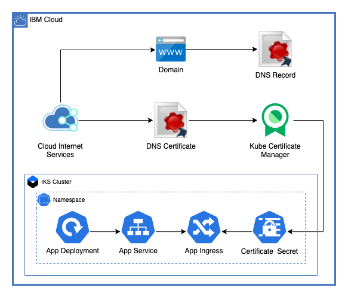

# CIS Ingress Application Deployment

This module uses the IBM Cloud Terraform Provider and the Kubernetes Terraform Provider to deploy an ingress application on an IKS cluster to a domain using CIS.

---

## Table of Contents

1. [Setup](##Setup)
2. [CIS Resources](##CIS-resources)
3. [Application Deployment](##Application-Deployment)
4. [Module Variables](##Module-Variables)

---

## Setup

In order to use this module, make sure that your domain is connected to your CIS instance. If the application will be deployed into a namespace other than `default`, make sure that your `all-icr-io` secret is copied to that namespace so that the docker image can be pulled from ICR.

### Creating the Demo Application

To create the demo hello-world application and upload it to ICR see the [README](./demo_app/README.md)

---

## CIS Resources

These resources are created for the CIS instance.

### Domain Settings

This sets up domain settings for your CIS instance. By default, it sets the TLS mode to `End-to-End Flexible`, and turns Always Use HTTPS and Automatic HTTPS rewrites on.

### DNS Record

This creates a CNAME DNS record to point to the domain

### Certificate Manager Cert

This orders a cert for the domain and adds it to the default CMS instance for your cluster.

---

## Application Deployment

### Deployment

Creates an application deployment

### Service

Creates a service for the deployment

### Ingress

Creates an ingress for the service using the created cert for TLS

---

## Module Variables

Variable                   | Type   | Description                                                           | Default
---------------------------|--------|-----------------------------------------------------------------------|--------
`ibmcloud_api_key`         | string | The IBM Cloud platform API key needed to deploy IAM enabled resources |
`ibm_region`               | string | IBM Cloud region where all resources will be deployed                 |
`resource_group`           | string | Name of resource group to create VPC                                  | `asset-development`
`generation`               | number | generation for VPC. Can be 1 or 2                                     | `2`
`cluster_name`             | string | Name of the cluster where resources will be provisioned               |
`cert_name`                | string | Name of certificate to create                                         | `demo-cert`
`cert_description`         | string | The description for the certificate being created                     | `A demo certificate`
`cis_name`                 | string | Name of the CIS instance where resources will be provisioned          |
`cis_plan`                 | string | Plan for CIS instance                                                 | `enterprise-usage`
`subdomain`                | string | Name of the subdmain to use                                           | `test`
`domain`                   | string | The domain to add to CIS                                              | `gcat-asset-test.com`
`always_use_https`         | bool   | Always use HTTPS for domain                                           | `true`
`automatic_https_rewrites` | bool   | Automatically rewrite HTTP requests                                   | `true`
`application_name`         | string | Name for the application that will be deployed                        | `hello-world`
`ssl`                      | string | SSL Domain settings                                                   | `full`
`namespace`                | string | Namespace where the application will be deployed                      | `default`
`replicas`                 | number | Number of replicas for the deployment                                 | `3`
`image`                    | string | Image to deploy on the cluster                                        | `us.icr.io/asset-development/hello-world:1`
`path`                     | string | Application path                                                      | `/`
`port`                     | number | Port for application                                                  | `8080`
`target_port`              | string | Target port for application                                           | `8080`
