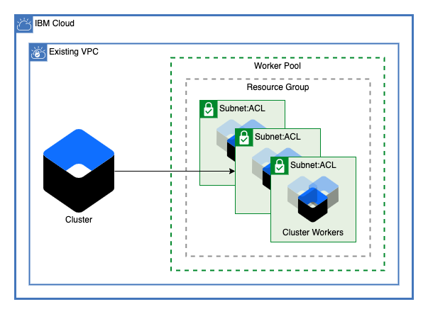

# VPC Cluster

This module deploys an IBM Cloud Kubernetes Cluster to an existing VPC.

IBM Cloud Kubernetes Service is a managed offering to create your own Kubernetes cluster of compute hosts to deploy and manage containerized apps on IBM Cloud. As a certified Kubernetes provider, IBM Cloud Kubernetes Service provides intelligent scheduling, self-healing, horizontal scaling, service discovery and load balancing, automated rollouts and rollbacks, and secret and configuration management for your apps. Combined with an intuitive user experience, built-in security and isolation, and advanced tools to secure, manage, and monitor your cluster workloads, you can rapidly deliver highly available and secure containerized apps in the public cloud.[1](https://cloud.ibm.com/docs/containers?topic=containers-overview)

## Optional Additions

This module allows the ability to optionally enable the use of Application Load Balancers, or ALB an external load balancer that listens for incoming HTTP, HTTPS, or TCP service requests. The ALB then forwards requests to the appropriate app pod according to the rules defined in the Ingress resource.[2](https://cloud.ibm.com/docs/containers?topic=containers-ingress-about) as well as additional worker pools in other resource groups.

---

### Table of Contents

1. [Cluster](##cluster)
2. [Optional Additions](#optional-additions)
    - [Worker Pools](#worker-pools)
3. [Application Load Balancers](#application-load-balancers)
4. [Worker Pools](#worker-pools-1)
5. [ALB Cert](#alb-cert)
6. [Module Variables](#module-variables)
7. [Outputs](#outputs)

---

## Cluster

This module allows for a cluster to be created accross any number of subnets in any number of zones within a single VPC. Optionally, public service endpoints on the cluster can be disabled to ensure that the public internet is not able to access the Kubernetes resources. For Gen2 VPC make sure your subnets have 256 available IPs to ensure the cluster can be created correctly.

## Application Load Balancers

After the cluster is created application both public and private Application Load Balancers can be enabled for the cluster.

## Worker Pools

This module allows the creation of any number of worker pools accross subnets. Worker pools can also be created in resource groups other than the one where the cluster is provisioned to limit access. Each worker pool can have a variable number of workers per zone.

---

## Module Variables

Variable                        | Type                                            | Description                                                                                                                                                                                                                                                                                                                                                                                                                                                                           | Default
------------------------------- | ----------------------------------------------- | ------------------------------------------------------------------------------------------------------------------------------------------------------------------------------------------------------------------------------------------------------------------------------------------------------------------------------------------------------------------------------------------------------------------------------------------------------------------------------------- |--------
ibm_region                      | string                                          | IBM Cloud region where all resources will be deployed                                                                                                                                                                                                                                                                                                                                                                                                                                 | 
resource_group_id               | string                                          | ID for IBM Cloud Resource Group where resources will be deployed                                                                                                                                                                                                                                                                                                                                                                                                                      | 
vpc_id                          | string                                          | ID of VPC where cluster is to be created                                                                                                                                                                                                                                                                                                                                                                                                                                              | 
subnets                         | list( object( { id = string zone = string } ) ) | List of subnet names and zones                                                                                                                                                                                                                                                                                                                                                                                                                                                        | `[]`
cluster_name                    | string                                          | Name of cluster to be provisioned                                                                                                                                                                                                                                                                                                                                                                                                                                                     | `"jv-gen2-tf-test-cluster"`
machine_type                    | string                                          | The flavor of VPC worker node to use for your cluster                                                                                                                                                                                                                                                                                                                                                                                                                                 | `"bx2.4x16"`
workers_per_zone                | number                                          | Number of workers to provision in each subnet                                                                                                                                                                                                                                                                                                                                                                                                                                         | `1`
disable_public_service_endpoint | bool                                            | Disable public service endpoint for cluster                                                                                                                                                                                                                                                                                                                                                                                                                                           | `false`
kube_version                    | string                                          | Specify the Kubernetes version, including the major.minor version. To see available versions, run ibmcloud ks versions. To use the default, leave string empty                                                                                                                                                                                                                                                                                                                        | `""`
wait_till                       | string                                          | To avoid long wait times when you run your Terraform code, you can specify the stage when you want Terraform to mark the cluster resource creation as completed. Depending on what stage you choose, the cluster creation might not be fully completed and continues to run in the background. However, your Terraform code can continue to run without waiting for the cluster to be fully created. Supported args are `MasterNodeReady`, `OneWorkerNodeReady`, and `IngressReady`   | `"IngressReady"`
tags                            | list(string)                                    | A list of tags to add to the cluster                                                                                                                                                                                                                                                                                                                                                                                                                                                  | `[]`
worker_pools                    | list                                            | List of maps describing worker pools                                                                                                                                                                                                                                                                                                                                                                                                                                                  | `[]`

---

## Outputs

| Name         | Value                                                              |
| ------------ | ------------------------------------------------------------------ |
| `cluster_id` | The ID of the cluster created                                      |
